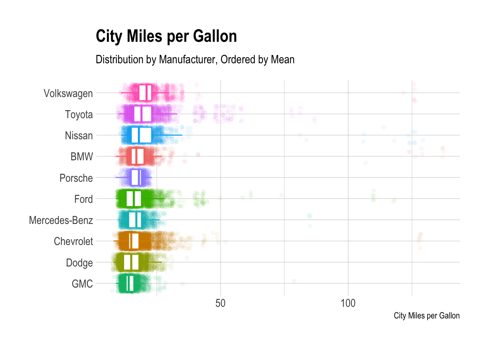

Car Fuel Economy
================
Jamie Hargreaves

``` r
library(tidyverse)

# read data
big_epa_cars <- readr::read_csv("https://raw.githubusercontent.com/rfordatascience/tidytuesday/master/data/2019/2019-10-15/big_epa_cars.csv")

# get top 10 most common makes
top_10 <- big_epa_cars %>%
  group_by(make) %>%
  summarise(count = n()) %>%
  top_n(10) %>%
  arrange(desc(count))

# join
library(magrittr)

big_epa_cars %<>%
  left_join(top_10)

library(hrbrthemes)

# visualise
big_epa_cars %>%
  filter(!is.na(count)) %>%
  ggplot(aes(x = reorder(make, city08, FUN = mean), y = city08, colour = make)) + 
  geom_jitter(alpha = 0.05) + 
  geom_boxplot(outlier.shape = NA) + 
  coord_flip() + 
  labs(
    x = NULL, 
    y = "City Miles per Gallon",
    title = "City Miles per Gallon",
    subtitle = "Distribution by Manufacturer, Ordered by Mean"
  ) + 
  theme_ipsum() + 
  theme(legend.position = "none")
```


